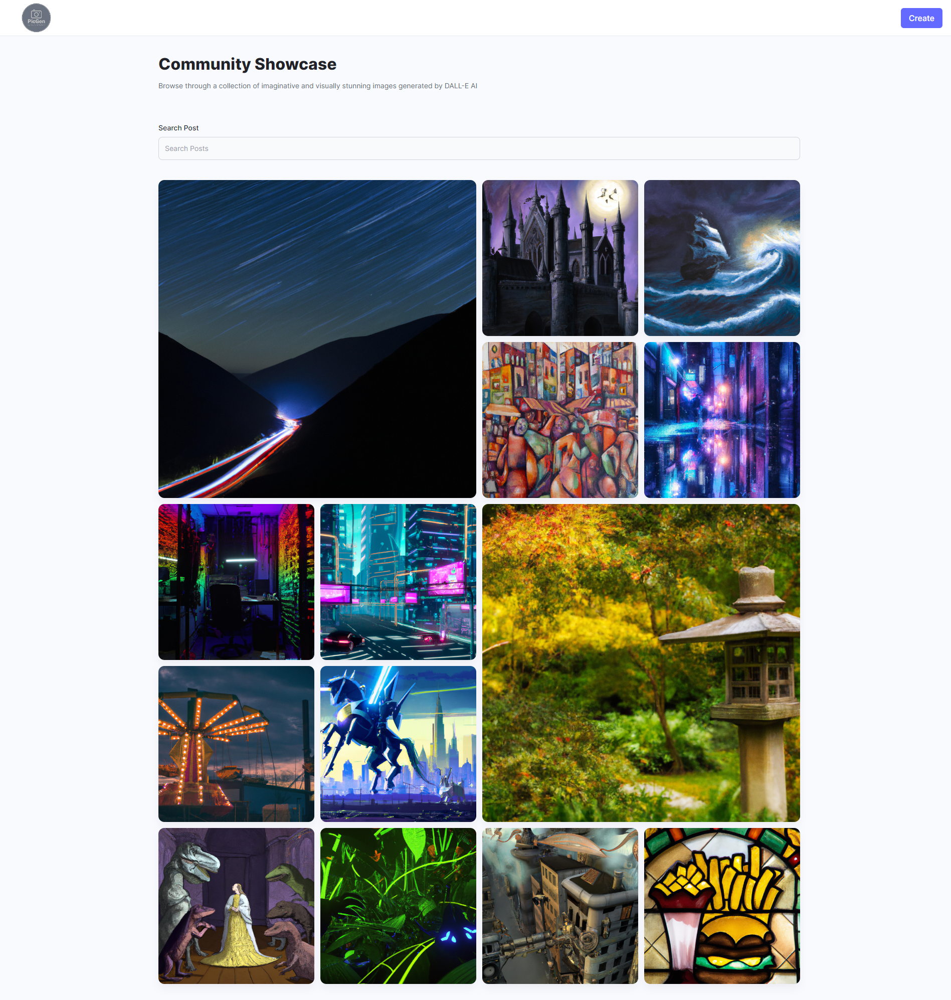

# AI Genrated Image Showcase

This project demonstrates the capabilities of OpenAI's DALL-E 2 model and OpenAI's API's by creating an interactive web application that allows users to generate, showcase, and download AI-generated images based on their prompts. You get your very own private showcase.

## Features
The calculator app includes the following features:

- Image Gallery: Browse through a gallery of AI-generated images, each accompanied by the prompt that inspired it. A download button is provided for easy image retrieval.
- Keyword Search: Use the search bar to find specific images. The app displays images whose prompts contain the entered search keywords.
- Generate Your Own: On a separate page, users can input their own prompts and generate AI images. A preview of the generated image is displayed, and users have the option to share it directly to the gallery.

## Screenshots
Here are few screenshots showcasing the user interface and functionality of the applicataion:

Description: The home screen showcase where you can see all of the generated images you shared.

Description: The Generate Image screen where you can enter in ypur prompt, generate an image and preview it before sharing it to the gallery showcase.

Description: (Example Image) One of my personal favorite generated image. Prompt Used: Romantic painting of a ship sailing in a stormy sea, with dramatic lighting and powerful waves.

## Technologies Used
Before running the app, make sure you have the following prerequisites installed and setup:

- Python
- Django
- Django_Rest_Framework
- OpenAI Python Package
- Cloudinary or Any other cloud provider

## Setup
- Clone this repository to your local machine.
- Install the required dependencies for the frontend and backend.
- Configure API keys for OpenAI and cloud service in the respective configuration files.
- Run the frontend and backend servers.
- Access the app through your web browser.

## About the Author
This project was created by Hashim Atiq. Feel free to connect with me on [LinkedIn](https://www.linkedin.com/in/hashim-atiq/) for any questions or further discussions.